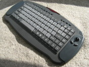
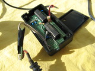
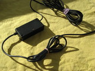
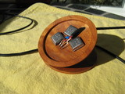
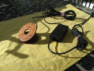
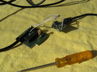
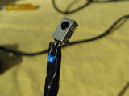
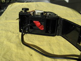
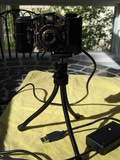
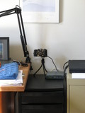

README for avrlirc
=============

avrlirc implements an IR receiver for use with lircd.  It connects
via a serial port, and the included host-based daemon relays the
IR commands to an lircd daemon locally or elsewhere on the network.

Advantages
----------
- Unlike the traditional LIRC "home-brew" serial port IR dongle, or
    even newer USB-based dongles, there is no requirement here for
    a special kernel driver.  Any serial port capable of at least
    38400 baud can be used, including USB-to-serial converters
    (which can also provide a convenient source of 5V power for the
    AVR micro).

- Unlike some other AVR-based solutions (which mostly connect via
    USB), there is no need for a new type of config -- the same
    lircd.conf file used for the home-brew receivers will work with
    this.  Nor is there a need for a special kernel driver.

- A side-effect of using a network connection to access lircd is that
    the avrlirc device need not be connected to the same machine as
    that which runs the lircd process that is interpreting the data. 
    In my case, I have IR receivers attached to several workstations,
    all of which control home automation and home audio tasks which
    run on a central server.  Using avrlirc, the lircd daemons can all
    run on the the central server (each listening on a differnt port)
    greatly simplifying configuration changes.

AVR part
--------
The first part is a simple program (avrlirc.c) that runs on an
ATTiny2313 AVR microcontroller, or probably many others, without much
work -- an onboard hardware-based UART is the main requirement.  (The
16-bit timer and the input capture register are used as well.) The
code monitors the pulse stream from a standard IR receiver (similar to
the Panasonic PNA4602M or Sharp GP1UD261XK0F), and sends the pulse
timing information to a host computer via the RS232 serial link.  The
data format is designed to closely match that of the LIRC
(www.lirc.org) UDP driver.

Host part(s)
------------
The second part of the project is a host daemon which
reads the avrlirc data stream from the serial port and relays it (via a
UDP socket connection) to a listening lircd daemon, which would
be started using a commandline like:

    lircd --driver=udp [ with optional --device=<port-number> ]

There are two versions of the host relay daemon included here:

## avrlirc2udp
The simpler one, avrlirc2udp.c, does everything one might need for
simple remote control handling:  it reliably waits for its configured
serial port to be available, converts any received data to UDP, and
forwards it to an lircd listening port.  It can also forward over TCP,
making it possible to pass through an ssh tunnel, for instance.  The
accompanying "udptcp" script can be used to relay back to UDP on the
far end.

## airboard-ir
The other host daemon, airboard-ir.c, implements all of that plus full
support for infrared (IR) keystroke and mouse data from an Airboard
keyboard, also known as a Liteon, or an SK-7100, made by Silitek.  The
keyboard has been rebadged by Motorola and Gateway, perhaps others. 
It forwards the user input data to the linux kernel, and forwards the
IR data to an instance of lircd.

Output from this program goes to three separate destinations:

 - Keyboard and mouse events can be injected into the kernel (using
   the uinput driver), where they will automatically become available
   to the rest of the system.

 - The "special" multimedia buttons can be directed to a specified UDP
   port.  (Otherwise they will be "injected" to the kernel, along with
   the rest of the keys.)

 - Consumer IR codes (from "regular" remote control devices) can be
   sent to an lircd server, using the LIRC UDP protocol.  Visit
   http://lirc.org/ for more information about lircd.

The code includes documentation for the reverse-engineered protocol
from the keyboard, if you wished to write a different sort of driver. 

(Rationale:  The Airboard has its own IR receiver, which works well
enough, except that a) the output is PS/2-only (a "dumb" PS/2-to-USB
adapter won't convert it), and worse, b), the mouse is serial-only --
again, a serial to PS/2 adapter won't help.  With the disappearance of
serial ports, and even of PS/2 ports, this otherwise excellent
keyboard is becoming obsolete.  Using airboard-ir with an avrlirc
receiver has obvious advantages.)

Building the code
-----------------
The AVR code was written using avr-gcc -- the Makefile is pretty simple.
Loading the hex file into the microcontroller, however, is beyond the
scope of this README.  :-)

The avrlirc2udp and airboard-ir programs assume POSIX termio access
for controlling access to the serial port.

Hardware
--------
See the top of avrlirc.c for a pinout diagram.  Other than 5V and
ground, the only connections are the IR receiver, one jumper between
two pins on the AVR, and the data output line.  An RS232 line driver
probably isn't necessary, since most consumer-grade serial ports these
days will accept TTL-level pseudo-RS232 signalling.  But a line driver
like the Maxim MAX233 can be used if necessary.

The 38400 baud rate seems to be fast enough to support any remotes
I've tried.  If it weren't, one might have to resort to adding a
crystal (and capacitors) to run the AVR micro faster.  At higher
speeds, you'll probably need to use the atmel's txd directly,
connected via an RS232 line driver (max232 or equiv).

If pin 7 on the ATtiny2313 is grounded, the code will emit a stream of
'U' characters on the serial port, useful for debugging the
transmission path.

Implementations
---------------
I've built several of these devices.  The first was before I'd
figured out that I could get away with fewer parts, so it's the
most complex.  It includes a 14.7456Mhz crystal, so the AVR can
put out 115.2Kbaud, and it includes a proper TTL-to-RS232 level
converter (it's a MAX233).  Because of this, it also has the capability
of receiving serial data from the host.  In principle I could
extend it to provide other information (I/O port pin status?) on
demand, or maybe add IR transmit capabilities, not that I've ever
felt the need.

The second that I built is also built around a cannibalized
USB-to-serial converter, but with a lower parts count:  there's no
Maxim chip to convert signal levels.  The "case" for the receiver was
given to me many years ago, much as you see it here, as a joke.  I'm
happy to get it out of the cellar and out to where it can be properly
displayed.

Background
----------
The code contained here is a follow-on to the avrlirc-0.0.5 project
released by Karl Bongers sometime in 2002.  This version was initially
written in April and May of 2007 by Paul Fox.  It bears little relationship
to Karl's initial code, but his code was an invaluable jumpstart.

Paul Fox, May 9, 2007  
(minor revision, Feb 9, 2009)  
(re-hosted at github, April 2013)  
pgf@foxharp.boston.ma.us

